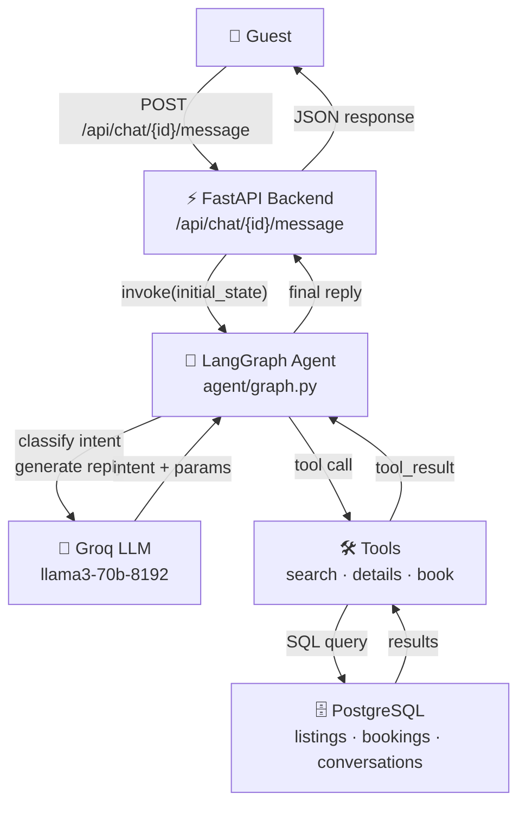
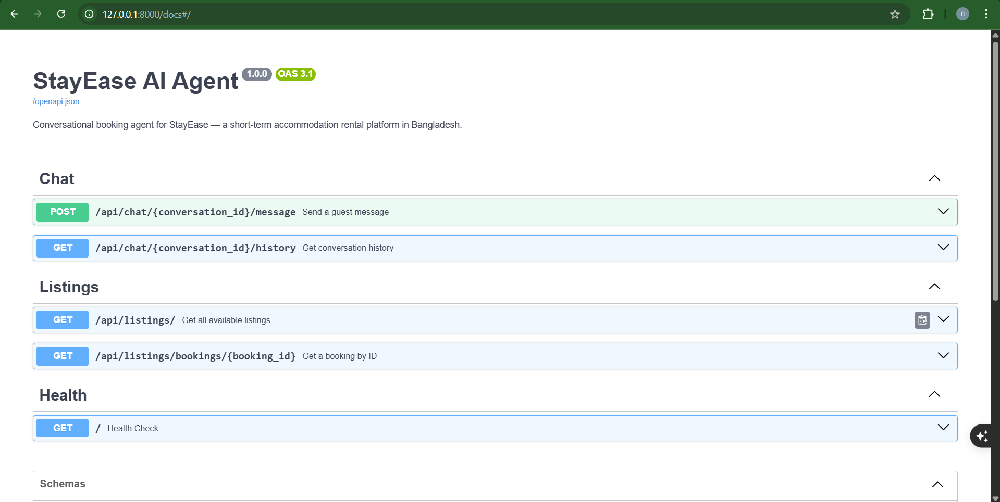
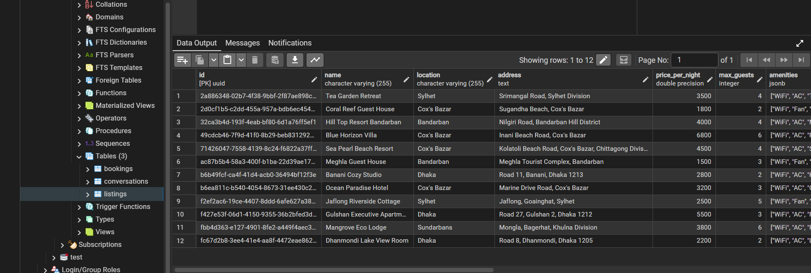
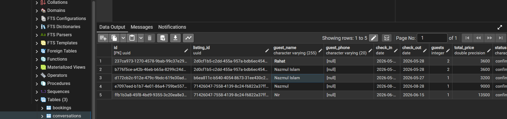
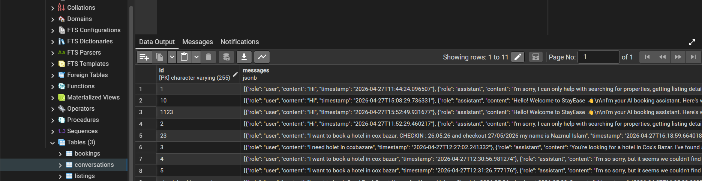

# StayEase AI Agent

A conversational AI booking agent for **StayEase** — a short-term accommodation rental platform in Bangladesh. Guests message the agent to search for available properties, get listing details, and make bookings.

---

## 1.1 System Overview

The StayEase AI Agent is a LangGraph-powered conversational agent exposed via a FastAPI REST API. When a guest sends a message, FastAPI routes it to the LangGraph agent, which uses a Groq-hosted LLM to classify the guest's intent and extract parameters. Based on the intent, the agent calls one of three tools that query a PostgreSQL database — searching for properties, fetching listing details, or creating a booking. The LLM then generates a natural, friendly reply, which is returned to the guest and persisted in the conversation history.



---

## 1.2 Conversation Flow

**Scenario:** Guest says *"I need a room in Cox's Bazar for 2 nights for 2 guests"*

| Step                                           | What happens                                                                                                                                                                                                                                                |
| ---------------------------------------------- | ----------------------------------------------------------------------------------------------------------------------------------------------------------------------------------------------------------------------------------------------------------- |
| **1. Guest sends message**               | `POST /api/chat/conv-001/message`with `{"message": "I need a room in Cox's Bazar for 2 nights for 2 guests"}`                                                                                                                                           |
| **2. FastAPI receives request**          | `chat_router.py`validates the request body and calls `process_message()`in `chat.py`                                                                                                                                                                  |
| **3. Load conversation**                 | `chat.py`queries the `conversations`table for `conv-001`. If not found, creates a new record. Appends the user message to the `messages`JSONB array.                                                                                                |
| **4. Build initial state**               | Constructs `AgentState`with full message history, all other fields `None`or `False`                                                                                                                                                                   |
| **5. LangGraph: classify_intent node**   | Sends the latest message to Groq LLM with a classification prompt. LLM responds with JSON:`{"intent": "search", "search_params": {"location": "Cox's Bazar", "check_in": "2025-05-01", "check_out": "2025-05-03", "guests": 2}, ...}`                     |
| **6. Conditional routing**               | `route_by_intent()`sees `intent == "search"`→ routes to `run_tool`node                                                                                                                                                                               |
| **7. LangGraph: run_tool node**          | Calls `search_available_properties(location="Cox's Bazar", check_in="2025-05-01", check_out="2025-05-03", guests=2)`. Tool queries PostgreSQL:`SELECT * FROM listings WHERE location ILIKE '%Cox's Bazar%' AND max_guests >= 2 AND is_available = true` |
| **8. Tool returns results**              | Returns list of 3 matching properties with IDs, names, and prices in BDT                                                                                                                                                                                    |
| **9. LangGraph: generate_response node** | Sends tool results + chat history to Groq LLM. LLM generates a friendly reply listing the properties with formatted BDT prices                                                                                                                              |
| **10. State updated**                    | Assistant reply appended to `messages`in state                                                                                                                                                                                                            |
| **11. Persist conversation**             | `chat.py`saves updated `messages`array back to the `conversations`table                                                                                                                                                                               |
| **12. Response returned**                | FastAPI returns `{"conversation_id": "conv-001", "reply": "Here are 3 available properties in Cox's Bazar...", "should_escalate": false, "timestamp": "..."}`                                                                                             |

---

## 1.3 LangGraph State Design

Defined in `com/app/agent/state.py` as a `TypedDict`:

```python
class AgentState(TypedDict):
    conversation_id: str          # Identifies the session for DB load/save
    messages: list[dict]          # Full chat history — passed to LLM for context
    intent: Optional[str]         # Classified intent — drives conditional routing ("search" | "details" | "book" | "greeting" | "escalate")
    search_params: Optional[dict] # Extracted location/dates/guests — consumed by search tool
    selected_listing_id: Optional[str]  # Which property the guest is asking about or booking
    booking_params: Optional[dict]      # Guest name/phone — needed to create a booking record
    tool_result: Optional[Any]    # Raw tool output — formatted into the final reply
    should_escalate: bool         # Signals a human agent takeover is needed
```

---

## 1.4 Node Design

```
classify_intent → (conditional) → run_tool → generate_response → END
                               ↘ greeting → END
                               ↘ escalate → END
```

| Node                  | What it does                                                        | Updates state                                                           | Next node                                  |
| --------------------- | ------------------------------------------------------------------- | ----------------------------------------------------------------------- | ------------------------------------------ |
| `classify_intent`   | Detects greetings (fast path) or sends to LLM for intent extraction | `intent`,`search_params`,`selected_listing_id`,`booking_params` | `run_tool`,`greeting`, or `escalate` |
| `run_tool`          | Calls the correct tool based on intent and state params             | `tool_result`                                                         | `generate_response`                      |
| `generate_response` | Sends tool result to LLM to produce a natural guest-facing reply    | `messages`(appends assistant reply)                                   | `END`                                    |
| `greeting`          | Responds with a friendly welcome message and guidance               | `messages`(appends welcome reply)                                     | `END`                                    |
| `escalate`          | Produces a polite handoff message when request is out of scope      | `messages`,`should_escalate = True`                                 | `END`                                    |

---

## 1.5 Tool Definitions

### `search_available_properties`

* **When used:** Intent is `"search"` — guest provides location, dates, and guest count
* **Input parameters:**
  ```python
  location: str       # e.g. "Cox's Bazar"check_in: str       # YYYY-MM-DDcheck_out: str      # YYYY-MM-DDguests: int         # number of guests (≥1)
  ```
* **Output format:**
  ```json
  {  "status": "success",  "count": 3,  "properties": [    {      "id": "uuid",      "name": "Sea Pearl Beach Resort",      "location": "Cox's Bazar",      "price_per_night": 4500.0,      "max_guests": 4,      "amenities": ["WiFi", "AC", "Sea View"]    }  ]}
  ```

### `get_listing_details`

* **When used:** Intent is `"details"` — guest asks for more info about a specific property
* **Input parameters:**
  ```python
  listing_id: str     # UUID of the listing
  ```
* **Output format:**
  ```json
  {  "status": "success",  "listing": {    "id": "uuid",    "name": "Sea Pearl Beach Resort",    "location": "Cox's Bazar",    "address": "Kolatoli Beach Road, Cox's Bazar",    "price_per_night": 4500.0,    "max_guests": 4,    "amenities": ["WiFi", "AC", "Sea View", "Breakfast"],    "photo_urls": ["https://..."],    "house_rules": "No smoking. Check-in after 2pm.",    "is_available": true  }}
  ```

### `create_booking`

* **When used:** Intent is `"book"` — guest confirms they want to book a property
* **Input parameters:**
  ```python
  listing_id: str     # UUID of the listingguest_name: str     # Full nameguest_phone: str    # Contact number (optional)check_in: str       # YYYY-MM-DDcheck_out: str      # YYYY-MM-DDguests: int         # Number of guests
  ```
* **Output format:**
  ```json
  {  "status": "success",  "booking": {    "booking_id": "uuid",    "listing_name": "Sea Pearl Beach Resort",    "guest_name": "Rahim Uddin",    "check_in": "2025-05-01",    "check_out": "2025-05-03",    "nights": 2,    "guests": 2,    "total_price_bdt": 9000.0,    "status": "confirmed"  }}
  ```

---

## 1.6 Database Schema

### `listings`

| Column              | Type         | Notes                   |
| ------------------- | ------------ | ----------------------- |
| `id`              | UUID (PK)    | Auto-generated          |
| `name`            | VARCHAR(255) | Property name           |
| `location`        | VARCHAR(255) | City/area (searchable)  |
| `address`         | TEXT         | Full street address     |
| `price_per_night` | FLOAT        | In BDT                  |
| `max_guests`      | INTEGER      | Capacity                |
| `amenities`       | JSONB        | `["WiFi", "AC", ...]` |
| `photo_urls`      | JSONB        | List of image URLs      |
| `house_rules`     | TEXT         | Freeform rules          |
| `is_available`    | BOOLEAN      | Default true            |
| `created_at`      | TIMESTAMP    | Auto                    |

### `bookings`

| Column          | Type                     | Notes                       |
| --------------- | ------------------------ | --------------------------- |
| `id`          | UUID (PK)                | Auto-generated              |
| `listing_id`  | UUID (FK → listings.id) |                             |
| `guest_name`  | VARCHAR(255)             |                             |
| `guest_phone` | VARCHAR(20)              | Optional                    |
| `check_in`    | DATE                     |                             |
| `check_out`   | DATE                     |                             |
| `guests`      | INTEGER                  |                             |
| `total_price` | FLOAT                    | In BDT                      |
| `status`      | VARCHAR(50)              | `confirmed`/`cancelled` |
| `created_at`  | TIMESTAMP                | Auto                        |

### `conversations`

| Column         | Type              | Notes                            |
| -------------- | ----------------- | -------------------------------- |
| `id`         | VARCHAR(255) (PK) | Client-provided conversation ID  |
| `messages`   | JSONB             | `[{role, content, timestamp}]` |
| `created_at` | TIMESTAMP         | Auto                             |
| `updated_at` | TIMESTAMP         | Auto-updated on each turn        |

---

## Setup & Running

```bash

# 1. Clone and install
pip install -r requirements.txt

# 2. Configure environment
cp .env.example .env
# Edit .env with your Groq API key and DB credentials

# 3. Run with Docker Compose
docker compose up --build

# 4. Or run locally (with PostgreSQL running)
python -m com.app.main or python -m uvicorn com.app.main:app --reload --port 8000
```

API docs available at: `http://localhost:8000/docs`

---

## Full Conversation Trace (Booking + Escalation)

This example demonstrates a complete multi-turn conversation where the agent handles a greeting, searches for properties, provides details, collects missing information for a booking, and finally escalates an out-of-scope payment request.

**Guest:** Hi
**Agent:** Hello! Welcome to StayEase 👋
I'm your AI booking assistant. Here's what I can help you with:
🔍 **Search** — Find available properties by location, dates, and number of guests
🏠 **Details** — Get full information about a specific property
📅 **Book** — Create a confirmed booking for your stay
To get started, just tell me where you'd like to stay and your travel dates!

**Guest:** I want to know available hotel in cox bazar**Agent:** We've found some great options for you in Cox's Bazar. Here are 4 available properties:

1. **Sea Pearl Beach Resort**: BDT 4,500 per night (up to 4 guests)
2. **Ocean Paradise Hotel**: BDT 3,200 per night (up to 3 guests)
3. **Coral Reef Guest House**: BDT 1,800 per night (up to 2 guests)
4. **Blue Horizon Villa**: BDT 6,800 per night (up to 6 guests)
   Which one of these properties interests you?

**Guest:** I prefer this one: Coral Reef Guest House
**Agent:** You've chosen the **Coral Reef Guest House**. Here are the details:
📍 Location: Sugandha Beach, Cox's Bazar
💰 Price: BDT 1,800 per night
👥 Max Guests: 2
✨ Amenities: WiFi, Fan, Shared Bathroom, Rooftop Access
Would you like to book this guest house or need more information?

**Guest:** Yes. I am ok with that**Agent:** You're almost all set to book the Coral Reef Guest House for BDT 1,800 per night. To complete your booking, could you please provide me with the following details:

- Your full name
- Check-in date (YYYY-MM-DD)
- Check-out date (YYYY-MM-DD)

**Guest:** I will check in 26.05.26 and check out 28.05.26
**Agent:** You're all set to book the Coral Reef Guest House from 2026-05-26 to 2026-05-28. To complete your booking, I just need one more thing: **your full name**. Once I have that, I'll be happy to confirm your booking and provide you with a booking ID and the total price (BDT 3,600).

**Guest:** Register my name as Nazmul Islam
**Agent:** Hi Nazmul Islam, I'm happy to confirm that your booking at **Coral Reef Guest House** is complete.
📅 Stay: 2026-04-26 to 2026-04-28
🔖 Booking ID: 237ca973-1270-4578-9bab-99c37e290965
💰 Total Price: BDT 3,600
We're looking forward to welcoming you!

**Guest:** So I want to payment now
**Agent:** I'm sorry, I can only help with searching for properties, getting listing details, and making bookings. For anything else, **I'm connecting you with a human agent** who will assist you shortly. Thank you for your patience!

---

## API & Agent Visuals

### 1. API Endpoints Overview



### 2. Available Property Listings



### 3. Booking Confirmation



### 4. Conversation History Trace


